## 0% accidentes - Perfect
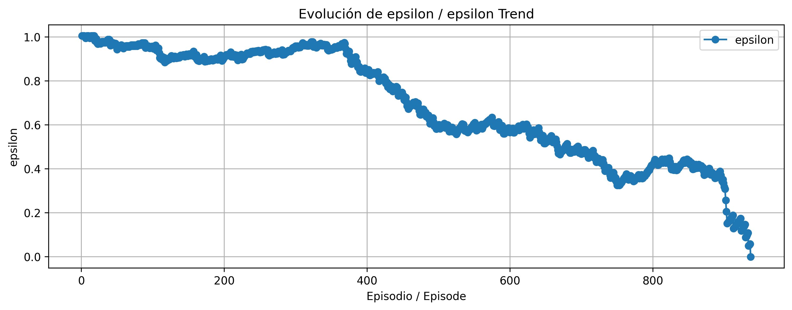

## 5% accidentes - Good


## 0% accidentes - Perfect


## 5% accidentes - Good


## 0% accidentes - Perfect
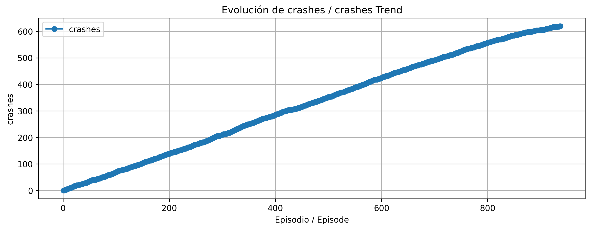

## 5% accidentes - Good


## 0% accidentes - Perfect


## 5% accidentes - Good
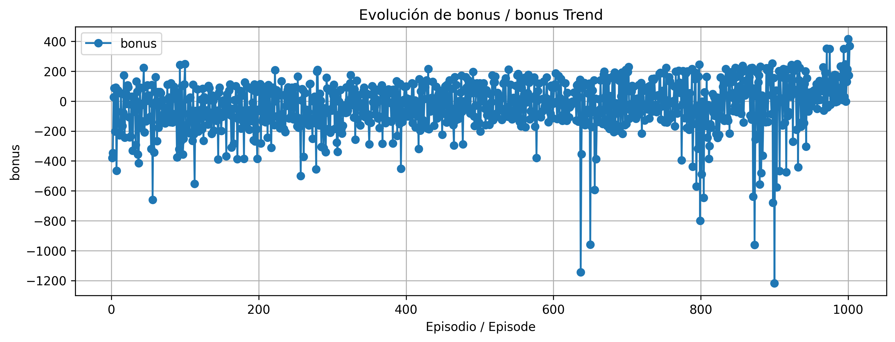

## 0% accidentes - Perfect


## 5% accidentes - Good
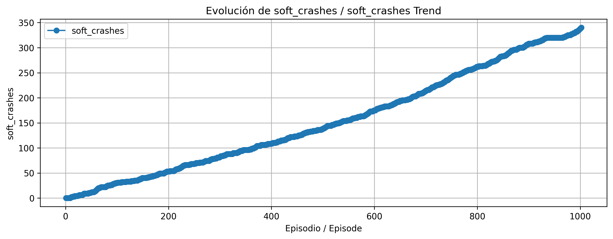

## 0% accidentes - Perfect


## 5% accidentes - Good
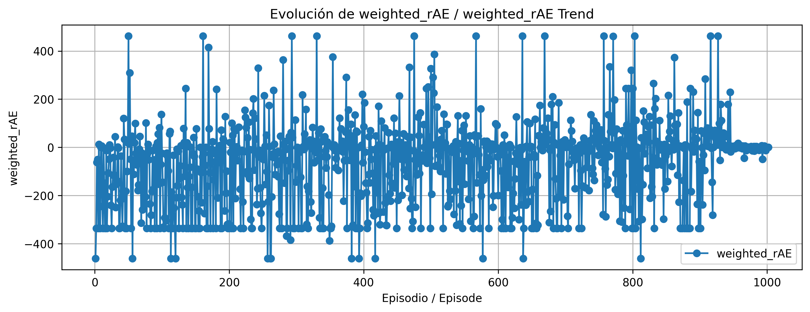

## 0% accidentes - Perfect
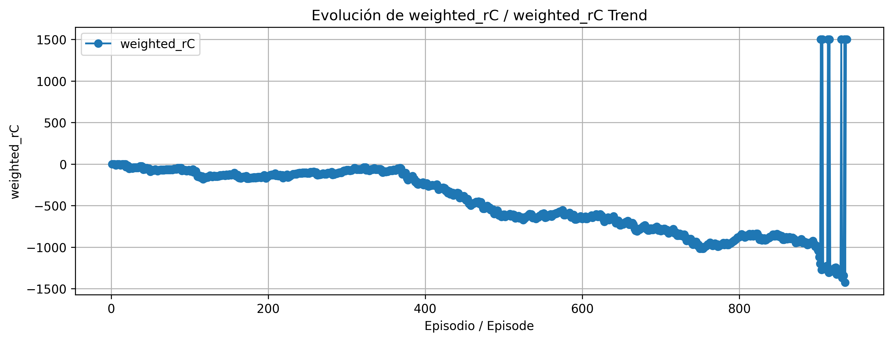

## 5% accidentes - Good


## 0% accidentes - Perfect
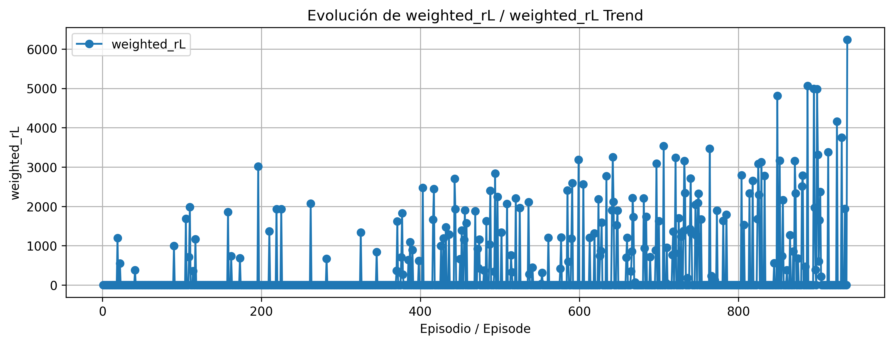

## 5% accidentes - Good
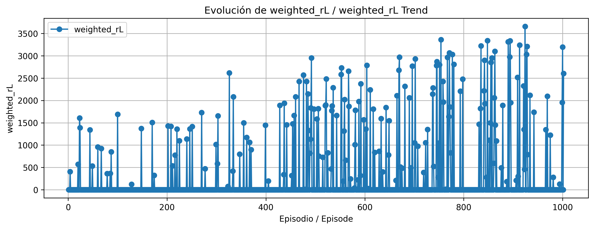

## 0% accidentes - Perfect
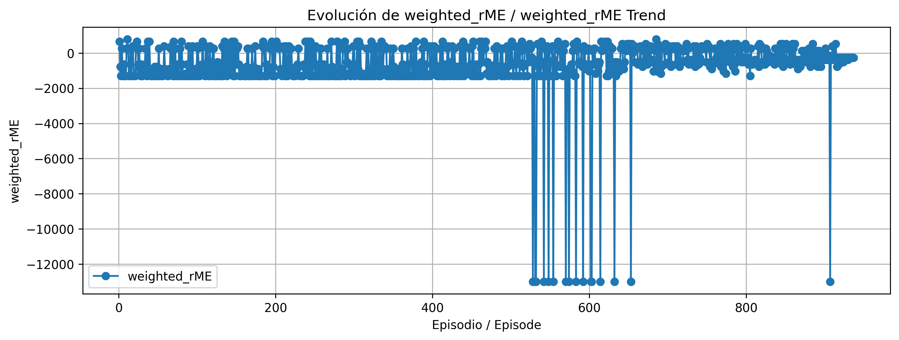

## 5% accidentes - Good


## 0% accidentes - Perfect


## 5% accidentes - Good


## 0% accidentes - Perfect
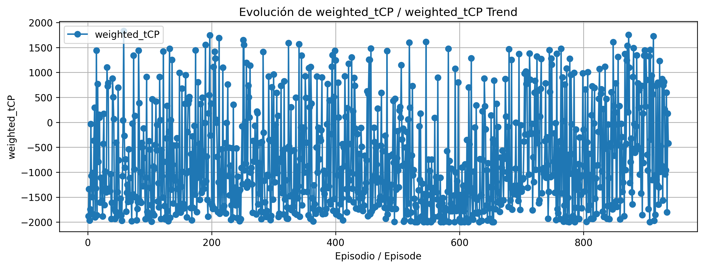

## 5% accidentes - Good
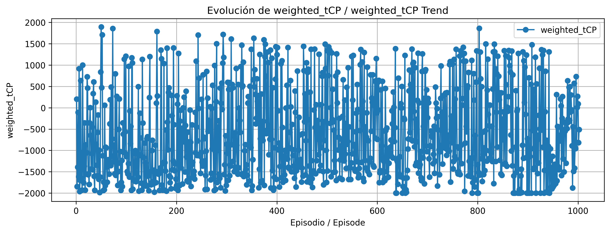

---

## 🔍 Comparative Analysis

- **Crash rate, landings, and epsilon**: Behave similarly between models.
- **Key differences:**

| Metric       | Perfect (0%)        | Good (5%)              |
|--------------|---------------------|--------------------------|
| **Bonus**     | Min: -400 pts       | Min: -1200 pts           |
| **rL**        | Peaks at ~6000 pts  | Stabilizes around ~3500 pts |
| **rME**       | Dips mid-training   | Dips at the end          |

---

## 🔧 Code Observations

```python
if wrong_direction:
    return {'reward': -100, 'WrongDirection': True}
```

---

## 💡 Learning Hypothesis

1. The model starts with **high randomness** (high epsilon).
2. As it begins to land correctly (by chance or early learning), **epsilon decays quickly**.
3. At that point, **wrong_direction** penalties are crucial to prevent excessive ascents.
4. Learn to landing whit constant hight scores and no crashes.
---

## 🛠 Optimization Possibilities

- **Improve altitude learning**: Help the agent avoid rising too quickly or unnecessarily.
- **Early stopping criteria**: Interrupt training if ~750 steps pass without altitude penalties.
- **Penalize lateral thrusters**: Add stronger penalties for unnecessary side thrusts after landing.

---

## 🚀 What the Best Models Learn

- **Safety**: No crashes.
- **Consistency**: Reliable, repeated landings.
- **Stability**: No destabilizing rotation.
- **Efficiency**: No redundant steps or wasteful behavior.

> ⚠️ *Room for improvement*: Lateral thrusters are sometimes used after safe landings. A **stronger penalty** post-landing could help reduce this.