## 0% accidentes - Perfecto
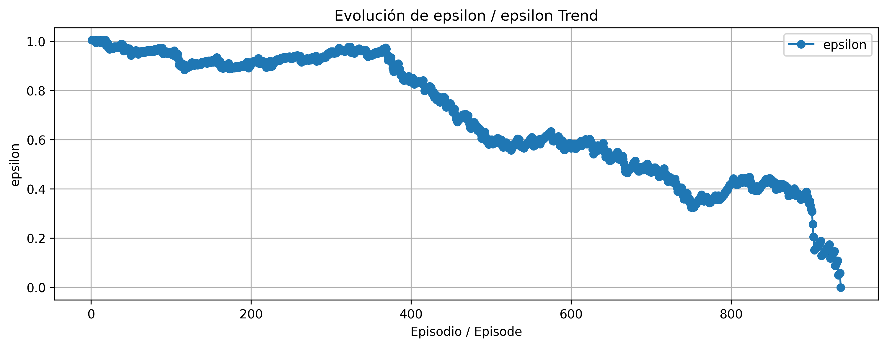

## 5% accidentes - Bueno
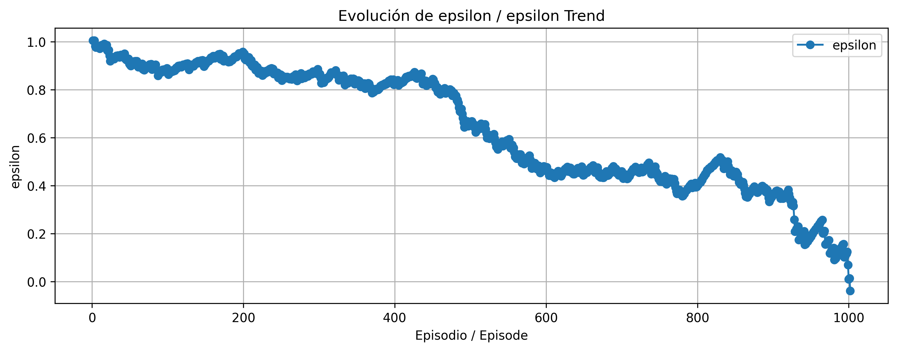

## 0% accidentes - Perfecto
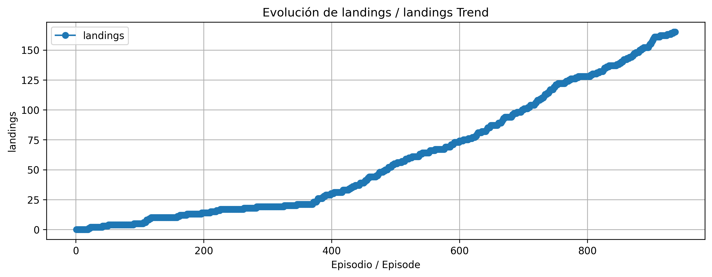

## 5% accidentes - Bueno
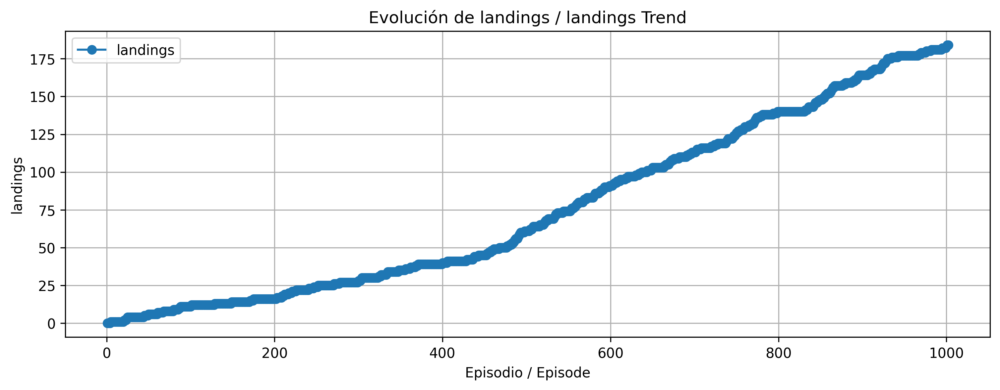

## 0% accidentes - Perfecto
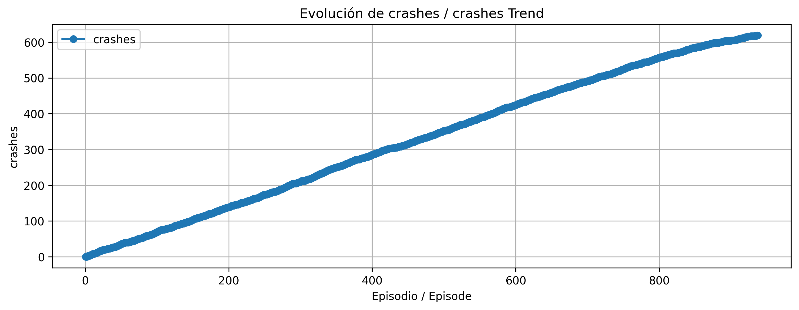

## 5% accidentes - Bueno
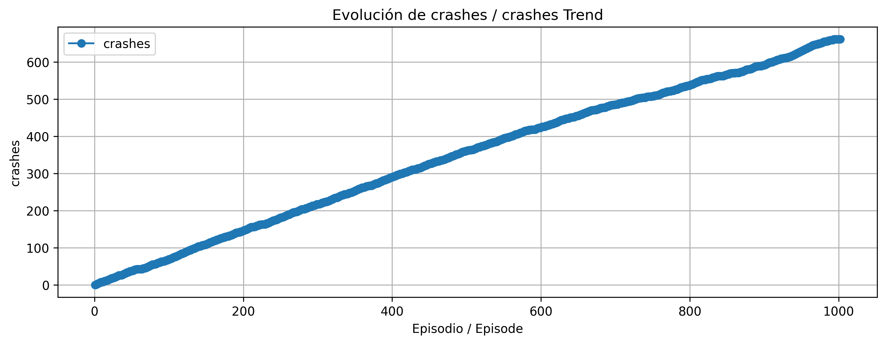

## 0% accidentes - Perfecto
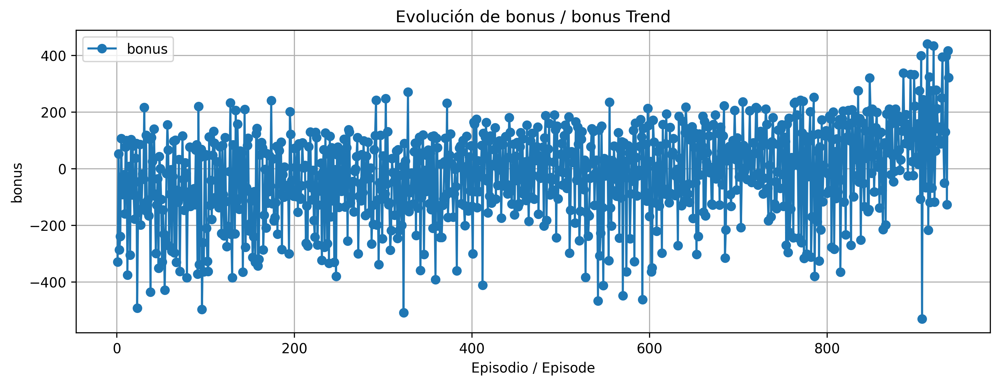

## 5% accidentes - Bueno
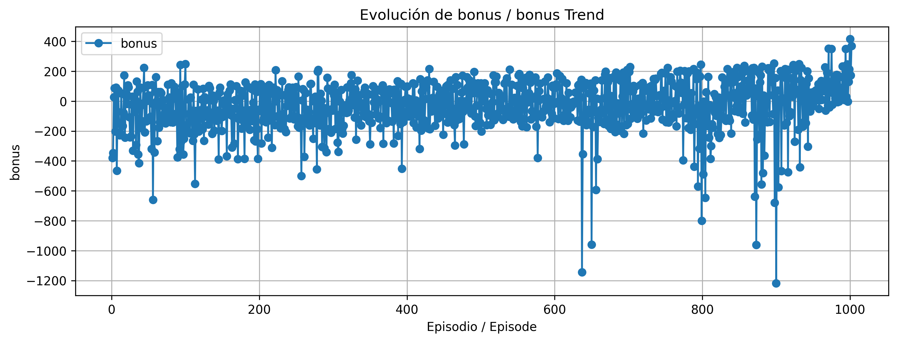

## 0% accidentes - Perfecto
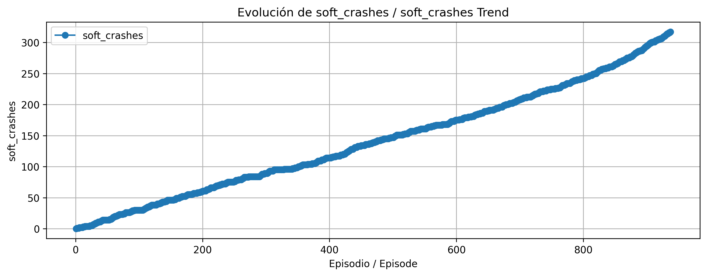

## 5% accidentes - Bueno
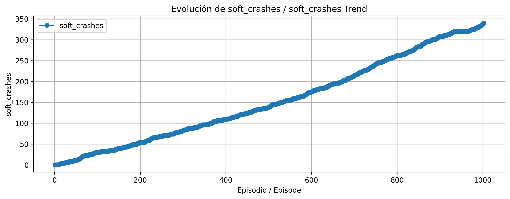

## 0% accidentes - Perfecto
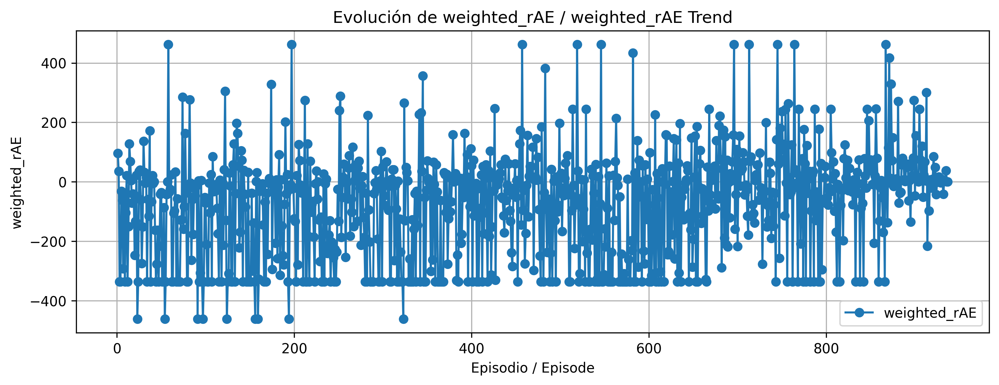

## 5% accidentes - Bueno
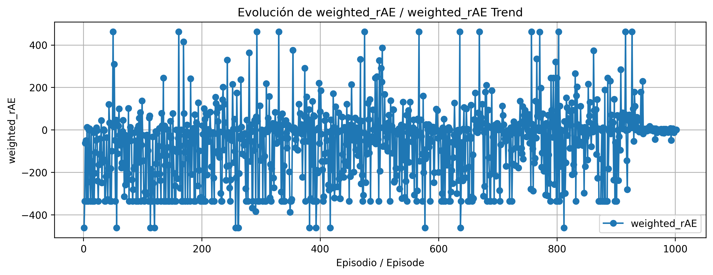

## 0% accidentes - Perfecto
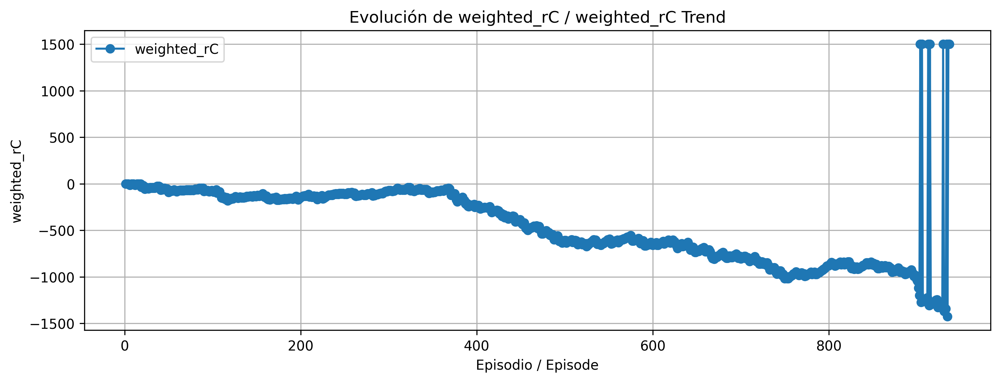

## 5% accidentes - Bueno
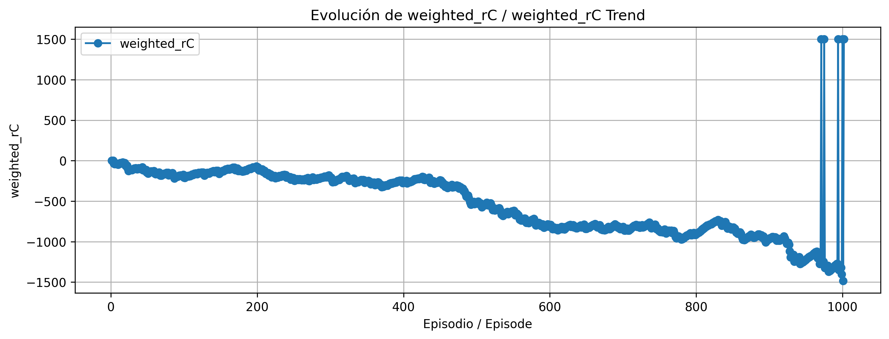

## 0% accidentes - Perfecto
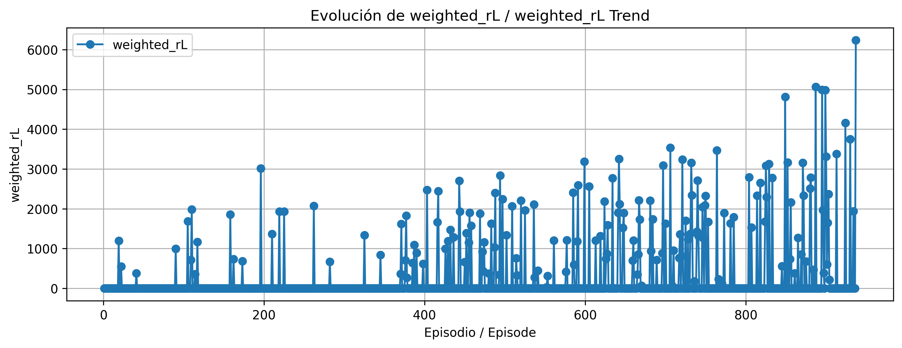

## 5% accidentes - Bueno


## 0% accidentes - Perfecto
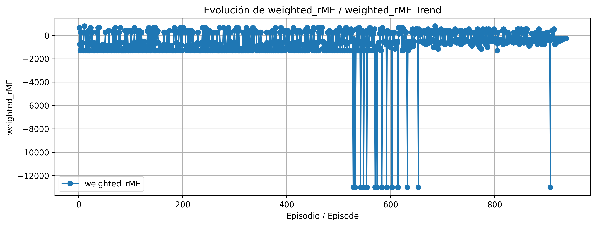

## 5% accidentes - Bueno
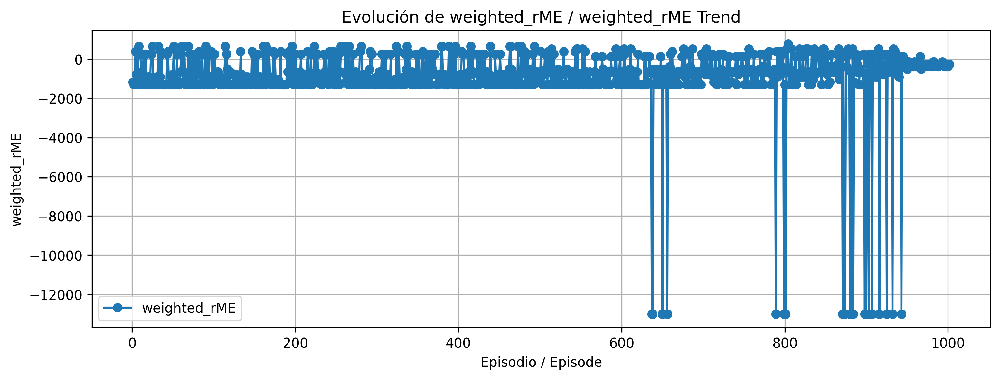

## 0% accidentes - Perfecto
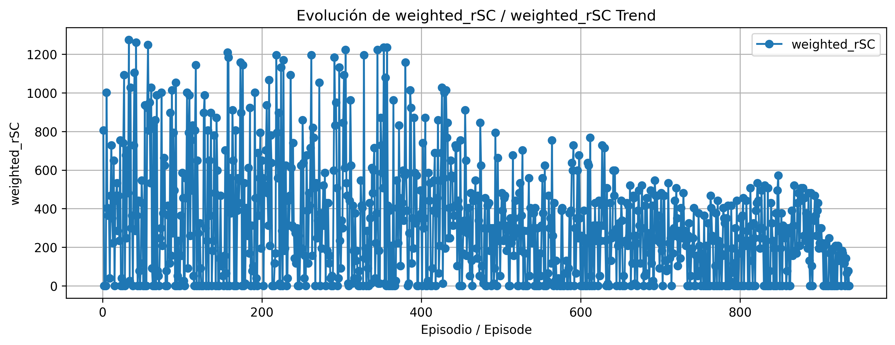

## 5% accidentes - Bueno
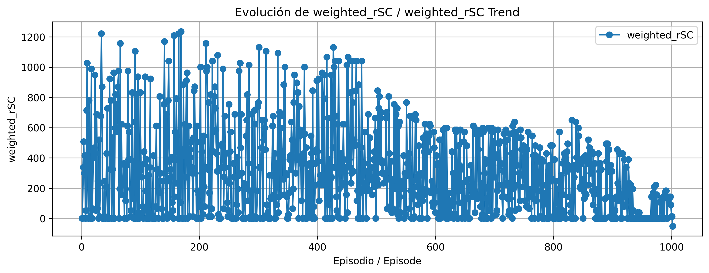

## 0% accidentes - Perfecto
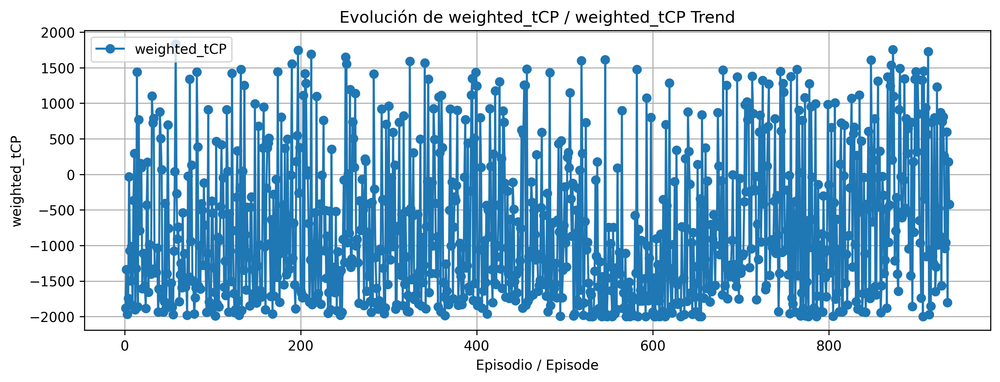

## 5% accidentes - Bueno


---

## 🔍 Análisis Comparativo

- **Tasa de accidentes, aterrizajes y epsilon**: Similares entre ambos modelos.
- **Diferencias clave:**

| Métrica         | Perfecto (0%)        | Bueno (5%)              |
|----------------|-----------------------|--------------------------|
| **Bonus**       | Mínimo: -400 pts     | Mínimo: -1200 pts       |
| **rL**          | Hasta 6000 pts       | Estable ~3500 pts       |
| **rME**         | Negativo a mitad     | Negativo al final       |

---

## 🔧 Observaciones del Código

```python
if wrong_direction:
    return {'reward': -100, 'WrongDirection': True}
```

---

## 💡 Hipótesis de Aprendizaje

1. **Exploración inicial** con epsilon alto.
2. Cuando empieza a aterrizar, el **epsilon cae**.
3. La penalización por `wrong_direction` es crucial para evitar ascensos excesivos en este punto.
4. Aprende a aterrizar de forma constante con alta puntuación.
---

## 🛠 Posibilidades de Optimización 

- **Mejorar el aprendizaje de altitud** para evitar ascensos innecesarios.
- **Criterio de parada temprana**: detener si no hay penalizaciones tras ~750 pasos.
- **Penalizar motores laterales** tras aterrizaje si se usan sin necesidad.

---

## 🚀 Lo que aprenden los mejores modelos

- **Seguridad**: No tienen accidentes.
- **Consistencia**: Aterrizan siempre.
- **Estabilidad**: Sin rotaciones peligrosas.
- **Eficiencia**: Sin pasos redundantes.

> ⚠️ *Área a mejorar*: Uso innecesario de motores laterales tras el aterrizaje. Se recomienda **aumentar la penalización**.


